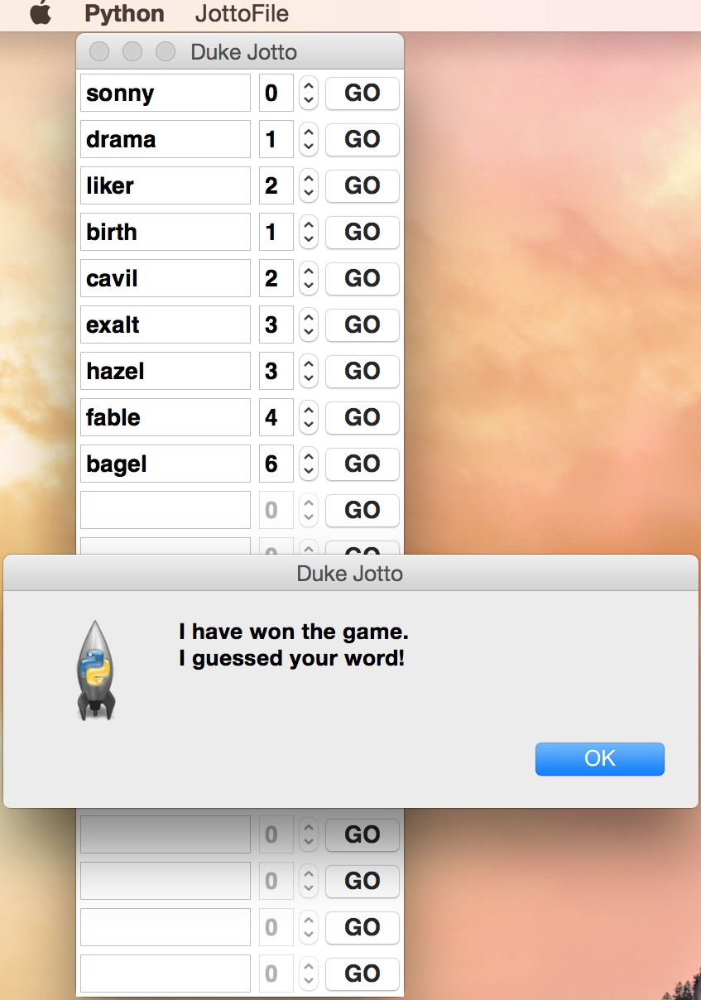

Jotto
=====
Simple AI for [Jotto](http://en.wikipedia.org/wiki/Jotto) word game

Overview
--------
This was my second programming assignment for CS101 (Intro to Computer Science). Jotto is a word game played with five-letter words where the computer tries to guess the human player's secret word in as few guesses as possible. I was given starter code in the form of two view-controller modules (``jottoMain.py`` for playing Jotto as a CLI and ``jottoGui.py`` for playing Jotto in a GUI) and a skeleton model module called ``jottoModel.py`` whose functions I needed to implement using what I'd recently learned in class about global state/variables in order to create a simple AI capable of intelligently guessing a human's secret word.

Algorithm
---------
The computer starts off with an initial list of 5757 possible five-letter words (read from ``kwords5.txt``) from which it randomly selects a word to use as its first guess for the human player's secret word. The computer then asks the human player how many letters are in common between the guess and the secret word (each letter in the guess can only be paired with up to one letter in the secret word, i.e. no double-counting) and reduces the list of possible words to only include those that have exactly that many letters in common (excluding the most recent guess since it was not correct). The computer then randomly selects a new word from the remaining list of possible words for its next guess and the process repeats until the computer correctly guesses the secret word.

Jotto CLI Instructions
----------------------
Choose a 5-letter word as your secret word and then launch Jotto by running ``python jottoMain.py``. For each guess by the computer, type the number of letters in common between the guess and your secret word and then press *Enter* to move on to the next guess. If the current guess matches your secret word exactly, enter 6 to indicate that the guess is correct and end the game.

```shell
$ python jottoMain.py 
Playing a game with  5  letter words
Number of words is  5757
My guess is 'brack', how many letters in common with your word:  2
Number of words left is 1320
My guess is 'regal', how many letters in common with your word:  4
Number of words left is 56
My guess is 'laver', how many letters in common with your word:  3
Number of words left is 30
My guess is 'raged', how many letters in common with your word:  3
Number of words left is 6
My guess is 'largo', how many letters in common with your word:  3
Number of words left is 2
My guess is 'gable', how many letters in common with your word:  5
Number of words left is 1
My guess is 'bagel', how many letters in common with your word:  6
I win!! it took me  7  guesses
```

Jotto GUI Instructions
----------------------
Choose a 5-letter word as your secret word and then launch Jotto by running ``python jottoGui.py``. Go to **JottoFile > New Game** to start a new game. For each guess by the computer, increment the counter field to display the the number of letters in common between the guess and your secret word and then click **GO** to move on to the next guess. If the current guess matches your secret word exactly, set the counter field to 6 to indicate that the guess is correct and click **GO** to end the current game.


